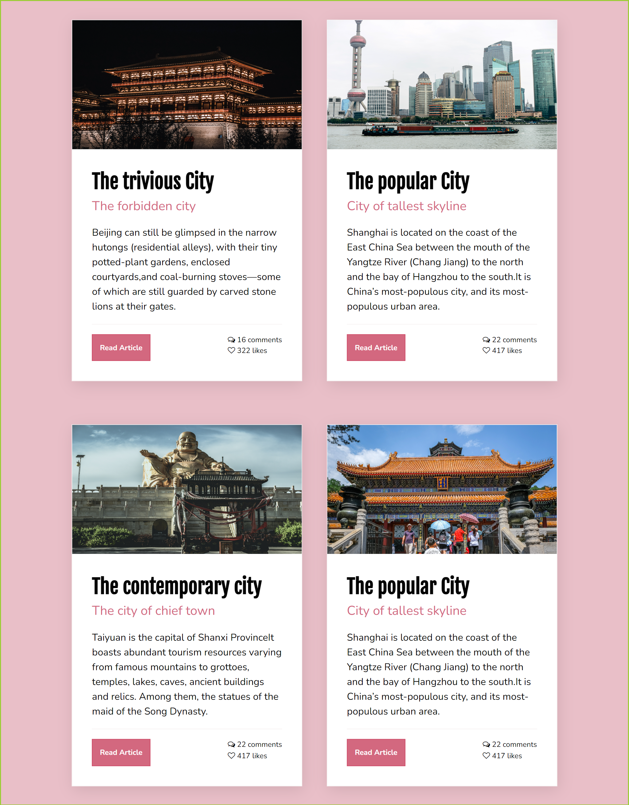

## Table of contents

- [Table of contents](#table-of-contents)
- [Overview](#overview)
  - [Screenshot](#screenshot)
  - [Links](#links)
- [My process](#my-process)
  - [Built with](#built-with)
  - [What I learned](#what-i-learned)
  - [Continued development](#continued-development)
  - [Useful resources](#useful-resources)
- [Author](#author)
- [Acknowledgments](#acknowledgments)


## Overview
I created mini card about different city in china i have visited

### Screenshot





### Links

- Solution URL: (https://)
- Live Site URL: (https://)

## My process

### Built with

- Semantic HTML5 markup
- CSS custom properties
- Flexbox


### What I learned

For me it was very dificult to choose the right properties in css to get the body and the .card to work and flexbox properties.

At the end, i believe i did a good job with the things that i used.
Always open to any comments


```css
.flex-container {
        width: 100%;
        display: flex;
        gap: 10px;
        margin: 0 auto;
        flex-wrap: wrap;
        justify-content: center;
        align-items: center;
        
    }

### Continued development

I would like to make more flebox layout to get familiar.

The card could be links to a document or something along those ways. Going to think about something useful that could come in handy.

### Useful resources

- [understanding css](https://www.taniarascia.com/) - This helped me to understand better how to use flexbox.


## Author

- Frontend Mentor - [@lidma](https://www.frontendmentor.io/profile/lidma)

## Acknowledgments


At some point i was a little stuck with setting the style for the image. And i found this video helpful.

(https://www.youtube.com/watch?v=G3e-cpL7ofc&t=12446s)
